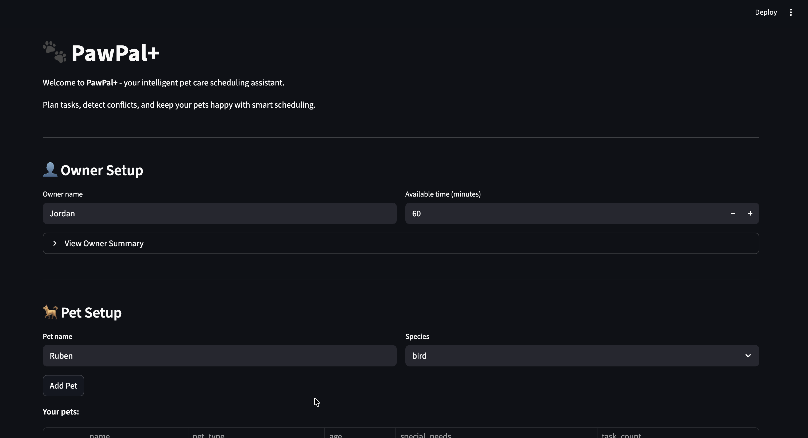
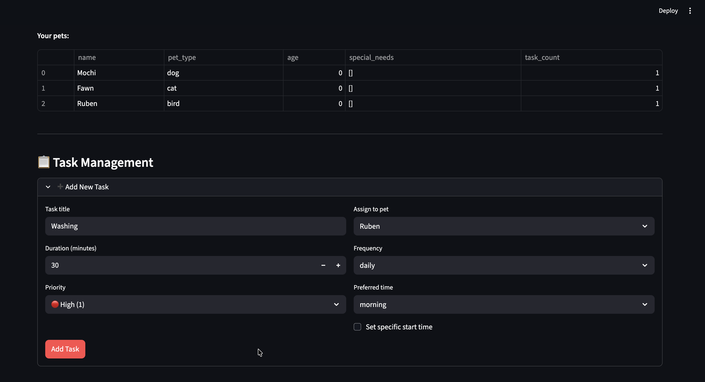
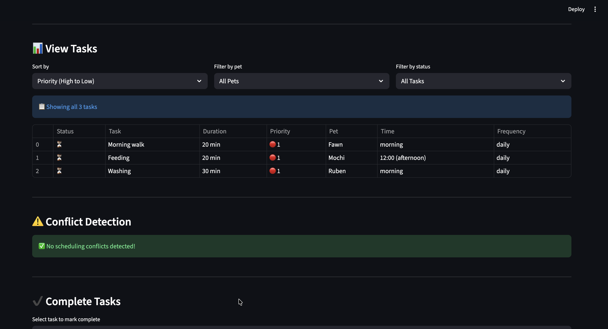
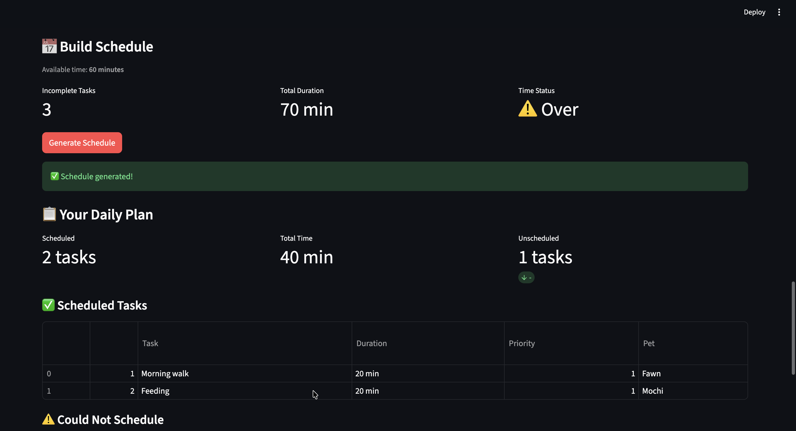

# PawPal+

**Intelligent Pet Care Scheduling System**

A Streamlit-powered application that helps pet owners organize, prioritize, and schedule care tasks for their pets with smart conflict detection and recurring task management.

---

## Demo Screenshots









---

## Features

### 1. Priority-Based Scheduling Algorithm

The scheduler uses a **greedy algorithm** that processes tasks in priority order (1 = highest, 5 = lowest) and fits them into available time slots.

```
Algorithm: generate_plan()
1. Sort all tasks by priority (ascending)
2. For each task in sorted order:
   - If task is completed -> skip
   - If task fits in remaining time -> schedule it
   - Otherwise -> add to unscheduled list
3. Return DailyPlan with reasoning
```

**Time Complexity:** O(n log n) for sorting + O(n) for scheduling = O(n log n)

### 2. Sorting by Time (Chronological Ordering)

Tasks can be sorted by preferred time of day using `sort_by_time()`:

| Preferred Time | Sort Order |
|----------------|------------|
| Morning        | 1 (first)  |
| Afternoon      | 2          |
| Evening        | 3          |
| Unknown        | 4 (last)   |

### 3. Conflict Warnings

The scheduler detects **overlapping time windows** between tasks with specific start times.

```
Algorithm: overlaps_with(task1, task2)
- A overlaps B if: A.start < B.end AND A.end > B.start
- Adjacent tasks (A.end == B.start) do NOT conflict
```

**Conflict Types:**
- **Same Pet Conflict**: Two tasks for the same pet at overlapping times
- **Owner Conflict**: Two tasks at overlapping times (owner cannot do both)

### 4. Daily Recurrence

When a recurring task is marked complete, the system automatically creates the next occurrence:

| Frequency | Next Due Date Calculation |
|-----------|---------------------------|
| once      | No new task created       |
| daily     | due_date + timedelta(days=1) |
| weekly    | due_date + timedelta(days=7) |

**Preserved Attributes:** The new task inherits priority, pet_name, preferred_time, start_time, and duration_minutes.

### 5. Multi-Criteria Filtering

Filter tasks dynamically using Scheduler methods:

| Method | Description |
|--------|-------------|
| filter_by_completion(bool) | Get completed or incomplete tasks |
| filter_by_pet(pet_name) | Get tasks for a specific pet |
| sort_by_priority() | Sort by priority (1 to 5) |
| sort_by_time() | Sort by time of day |

### 6. Input Validation

All inputs are validated at creation time:

| Validation | Rule |
|------------|------|
| Duration   | Must be >= 0 minutes |
| Priority   | Must be 1-5 |
| Frequency  | Must be once, daily, or weekly |
| Available Time | Must be >= 0 minutes |

---

## Architecture

### Class Diagram

See uml_final.png for the complete UML diagram.

| Class | Responsibility |
|-------|----------------|
| **Task** | Represents a pet care task with duration, priority, timing, and recurrence |
| **Pet** | Contains pet info and associated tasks |
| **Owner** | Contains owner preferences and list of pets |
| **Scheduler** | Core scheduling engine with sorting, filtering, and conflict detection |
| **DailyPlan** | Output container with scheduled/unscheduled tasks and reasoning |

---

## Installation

### Prerequisites

- Python 3.8 or higher
- pip package manager

### Setup

```bash
python -m venv .venv
source .venv/bin/activate  # Windows: .venv\Scripts\activate
pip install -r requirements.txt
```

### Running the App

```bash
streamlit run app.py
```

---

## Usage Guide

1. **Set Up Owner Profile** - Enter your name and available time (in minutes)
2. **Add Your Pets** - Add each pet with their name and species
3. **Create Tasks** - Specify name, duration, priority, frequency, and preferred time
4. **View and Filter Tasks** - Sort by priority or time, filter by pet or status
5. **Generate Schedule** - Create an optimized daily plan with reasoning
6. **Complete Tasks** - Mark tasks done to trigger recurring task generation

---

## Testing

### Running Tests

```bash
python -m pytest tests/test_pawpal.py -v
```

### Test Coverage

| Test Class | Tests | Description |
|------------|-------|-------------|
| TestTaskCompletion | 1 | Verifies mark_complete() changes task status |
| TestTaskAddition | 2 | Verifies adding tasks to pets |
| TestSortingEdgeCases | 4 | Chronological ordering and priority sorting |
| TestRecurringTasks | 5 | Daily/weekly recurrence with date boundaries |
| TestConflictDetection | 5 | Overlap detection and conflict types |
| TestScheduleGeneration | 6 | Plan generation with time constraints |
| TestValidation | 5 | Input validation and error handling |

### Key Edge Cases Tested

- **Sorting Correctness**: Tasks returned in chronological order
- **Recurrence Logic**: Completing a daily task creates a new task for the following day
- **Conflict Detection**: Scheduler flags duplicate times and overlapping tasks
- **Boundary Conditions**: Month/year transitions, zero available time, empty task lists

### Confidence Level: 4/5 Stars

**Test Results:** 28/28 tests passing

---

## File Structure

```
pawpal-starter/
├── app.py              # Streamlit UI
├── pawpal_system.py    # Core classes
├── main.py             # CLI demo
├── generate_uml.py     # UML diagram generator
├── uml_final.png       # Class diagram
├── requirements.txt    # Dependencies
├── README.md           # This file
└── tests/
    └── test_pawpal.py  # Test suite (28 tests)
```

---

## API Reference

### Task

```python
Task(
    name: str,
    duration_minutes: int,
    priority: int,              # 1-5
    frequency: str = "once",    # once, daily, weekly
    preferred_time: str = "morning",
    start_time: Optional[time] = None
)
```

### Scheduler

```python
scheduler = Scheduler(owner=owner, available_time=60)

# Core methods
scheduler.add_task(task, check_conflicts=True)
scheduler.complete_task(task_name)
scheduler.generate_plan()

# Sorting and filtering
scheduler.sort_by_priority()
scheduler.sort_by_time()
scheduler.filter_by_completion(completed=False)
scheduler.filter_by_pet(pet_name)

# Conflict detection
scheduler.has_conflicts()
scheduler.detect_conflicts()
scheduler.get_conflict_report()
```

---

## License

This project is for educational purposes as part of the AI110 Module 2 coursework.
